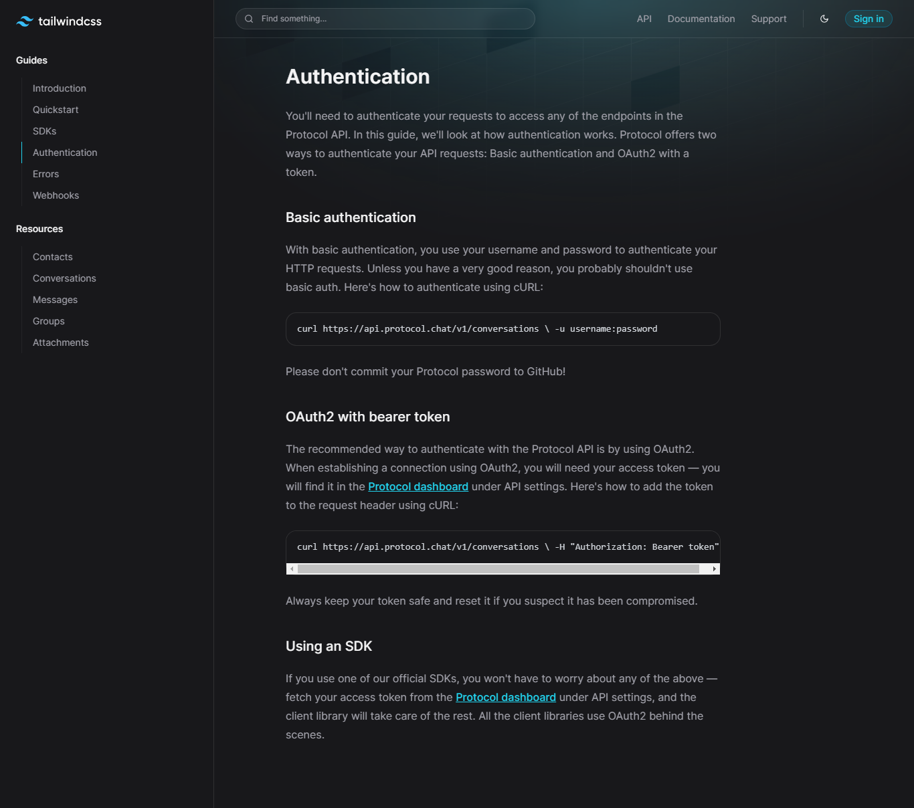

<h1 align="center">Protocol Tailwind UI</h1>

<p align="center">
  Protocol Tailwind UI is a project that aims to create a user interface (UI) copy of the official Tailwind CSS documentation. This copy will be developed using the Tailwind CSS framework and will allow users to interactively explore and understand the Tailwind CSS structure and components.
</p>

<p align="center">
  <a href="#-technologies">Technologies</a>&nbsp;&nbsp;|&nbsp;&nbsp;
  <a href="#-services">Services</a>&nbsp;&nbsp;|&nbsp;&nbsp;
  <a href="#-packages">Packages</a>&nbsp;&nbsp;|&nbsp;&nbsp;
  <a href="#-getting-started">Getting started</a>&nbsp;&nbsp;|&nbsp;&nbsp;
  <a href="#-features">Features</a>&nbsp;&nbsp;|&nbsp;&nbsp;
  <a href="#-links">Links</a>&nbsp;&nbsp;|&nbsp;&nbsp;
  <a href="#-versioning">Versioning</a>&nbsp;&nbsp;|&nbsp;&nbsp;
  <a href="#memo-license">License</a>
</p>

<p align="center">
  
</p>

<p align="center">
  
</p>

## 🚀 Technologies

Here are the technologies used in this project.

- TypeScript 5.1.6
- NodeJS 18.14.2
- Next 13.4.12
- TailwindCSS 3.3.3

## 📋 Services

Here are the services used in this project.

- [GitHub](https://github.com/)
- [Netlify](https://www.netlify.com/)

## 📦 Packages

Here are the production packages used in this project.

- <b>@tailwindcss/typography</b> -> Official Tailwind CSS plugin that adds predefined typography styles and typographic components to the Tailwind CSS framework.
- <b>lucide-react</b> -> Beautiful & consistent icon toolkit made by the community.

## 💻 Getting started

Here are the commands and steps on how to start the project.

### Dependency

- NodeJS
- NPM (Package manager of your choice)

### Steps

```bash
# To install dependencies.
npm install

# To start the project on your machine.
npm run dev

# To build the project.
npm run build

# To run the project in production.
npm run start

# To format the 'src' folder code using eslint settings.
npm run lint
```

## 🔥 Features

Here are the main features of the project.

- Responsive design.

## 📎 Links

- Deploy on [Netlify](https://www.netlify.com/): https://protocol-tailwind-ui.netlify.app/
- Repository: https://github.com/DevPedroHB/protocol-tailwind-ui

## 🔰 Versioning

Here are the versions of the parts of the project.

- WEB -> 1.0.0

## :memo: License

This project is licensed under the MIT license.

---

Made with ♥ by Pedro Henrique 🚀 [Never stop learning!](https://github.com/DevPedroHB)
